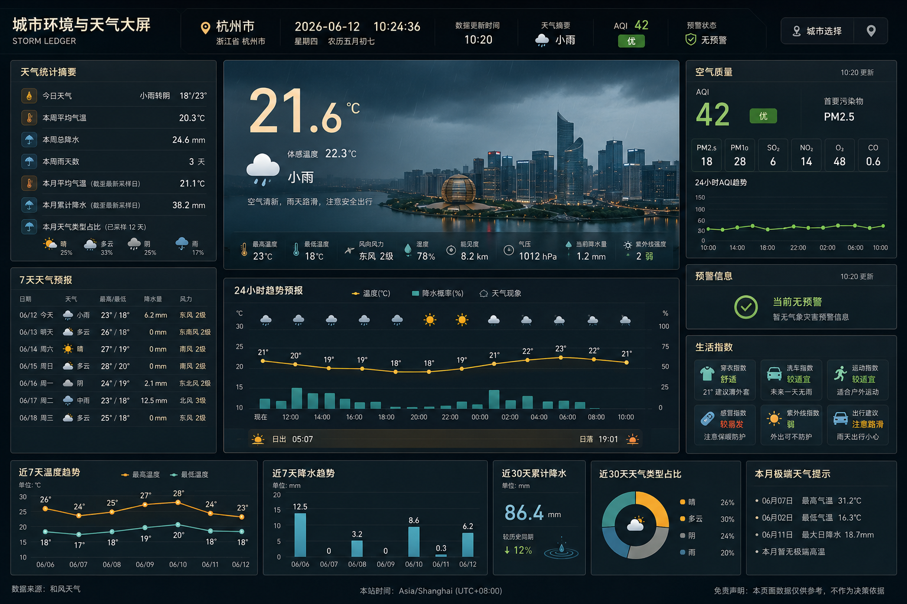
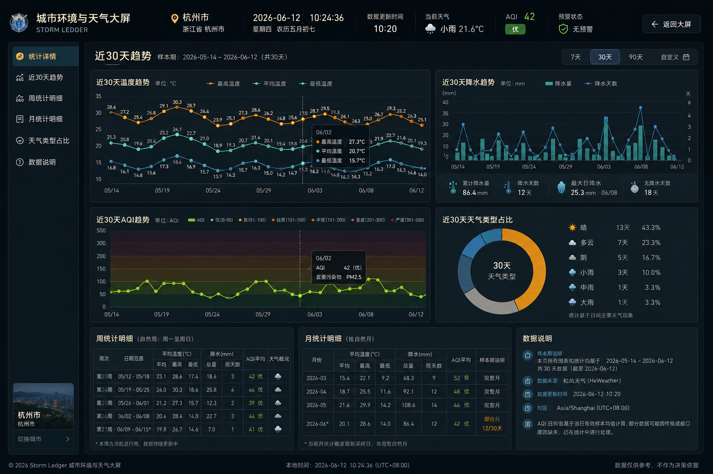

# 城市环境与天气大屏

`City Weather Dashboard` 是一个面向单城市场景的天气与环境可视化项目，采用前后端分离架构，聚合和风天气数据，提供实时天气、分钟级降水、24 小时趋势、7 天天气预报、空气质量、灾害预警、生活指数，以及周/月统计分析能力。

## 项目定位

- 前端：`React + Vite + TypeScript + React Router + Zustand + ECharts + SCSS`
- 后端：`Node.js + Express + TypeScript + SQLite`
- 数据源：和风天气
- 目标页面：首页大屏、城市选择抽屉、统计详情页

## 功能概览

- 首页聚合展示实时天气主模块，突出温度、体感、天气现象和分钟级降水摘要
- 展示 24 小时天气趋势、24 小时 AQI 趋势与 7 天天气预报
- 展示空气质量、灾害预警、生活指数、近 7 天趋势、月内摘要和天气类型占比
- 首次进入优先解析当前位置，失败时回退默认城市
- 统计详情页围绕近 30 天统计能力设计，包含周统计、月统计和样本期说明
- 当前前端统计趋势图已实现近 7 天 / 近 10 天切换展示，后续可继续扩展到完整 30 天窗口
- 后端统一代理和风天气请求，负责缓存、快照落库、聚合统计与统一响应

## 示例图

### 首页示例



### 统计详情页示例



## 目录结构

```text
weather-dashboard/
├── imgs/                  # README 示例图
├── scripts/               # 开发辅助脚本
├── server/                # Node.js + Express 后端
│   ├── src/app
│   ├── src/controllers
│   ├── src/db
│   ├── src/integrations/qweather
│   ├── src/repositories
│   ├── src/routes
│   ├── src/services
│   ├── src/types
│   └── src/utils
├── src/                   # React 前端
│   ├── components
│   ├── constants
│   ├── hooks
│   ├── pages
│   ├── stores
│   ├── styles
│   ├── types
│   └── utils
├── package.json
└── README.md
```

## 快速开始

### 1. 安装依赖

根目录安装前端依赖：

```bash
npm install
```

后端目录安装依赖：

```bash
cd server
npm install
```

### 2. 配置环境变量

在 `server` 目录下基于 `.env.example` 创建 `.env`：

```env
QWEATHER_API_KEY=your_qweather_api_key_here
QWEATHER_API_HOST=your-api-host.example.com
PORT=3201
DEFAULT_LOCATION_ID=101020100
DEFAULT_CITY_NAME=上海
DB_PATH=./data/weather.db
LOG_LEVEL=info
SNAPSHOT_RETENTION_DAYS=90
```

和风天气配置说明：

- `QWEATHER_API_KEY`：和风天气项目下创建的 `API KEY` 凭据
- `QWEATHER_API_HOST`：和风天气分配给当前凭据的专属 `API Host`，不要带 `https://`
- 如果还没有账号或凭据，可按以下顺序处理：
  - 进入 [和风天气开发者平台](https://dev.qweather.com/)
  - 阅读 [开始使用](https://dev.qweather.com/docs/start/)
  - 在控制台按 [项目和凭据](https://dev.qweather.com/docs/configuration/project-and-key/) 创建项目并添加 `API KEY`
  - 按 [身份认证](https://dev.qweather.com/docs/configuration/authentication/) 确认凭据类型，并获取对应 `API Host`

说明：

- 前端默认地址：`http://localhost:3200`
- 后端默认地址：`http://localhost:3201`
- 前端通过 `/api` 代理到后端
- 所有和风天气密钥必须通过环境变量提供，不能写入源码

### 3. 启动开发环境

在项目根目录执行：

```bash
npm run dev
```

该命令会同时启动前后端开发服务。

如需分别启动：

```bash
npm run dev:client
npm run dev:server
```

## 构建

前端构建：

```bash
npm run build
```

后端构建：

```bash
npm run server:build
```

## 页面说明

### 首页大屏

- 顶部状态栏
- 天气主模块
- 24 小时趋势
- 7 天天气预报
- 空气质量
- 预警信息
- 生活指数
- 周统计与月统计摘要

### 统计详情页

- 项目目标：近 30 天温度趋势、近 30 天降水趋势、近 30 天 AQI 趋势
- 当前实现：近 7 天 / 近 10 天趋势切换
- 周统计明细
- 月统计明细
- 天气类型占比
- 样本期、更新时间、数据来源说明

## 接口约束

- 所有前后端业务请求必须包含 `userId`
- 当前项目虽然是单用户模式，但接口层仍保留 `userId` 字段
- 前端请求封装会在 `src/utils/request.ts` 中自动注入系统用户 `userId`
- 文档中的接口示例默认省略域名，仅展示业务路径

请求示例：

```http
GET /api/screen/home?locationId=101020100&userId=system-user
```

```http
POST /api/location/resolve-current
Content-Type: application/json

{
  "lat": "31.2304",
  "lon": "121.4737",
  "userId": "system-user"
}
```

## 核心接口

- `GET /api/cities/search`：城市搜索，请求参数需带 `keyword` 与 `userId`
- `POST /api/location/resolve-current`：根据经纬度解析当前城市，请求体需带 `lat`、`lon`、`userId`
- `GET /api/screen/home`：首页聚合数据，请求参数需带 `locationId` 与 `userId`
- `GET /api/screen/overview`：首页概览
- `GET /api/screen/hourly`：24 小时天气趋势
- `GET /api/screen/minutely`：分钟级降水摘要
- `GET /api/screen/daily`：7 天天气预报
- `GET /api/screen/air/now`：实时空气质量
- `GET /api/screen/air/hourly`：空气质量小时趋势
- `GET /api/screen/alerts`：灾害预警
- `GET /api/screen/indices`：生活指数
- `GET /api/screen/stats/weekly`：周统计摘要
- `GET /api/screen/stats/monthly`：月统计摘要
- `GET /api/screen/stats/detail`：统计详情

## 数据与实现约束

- 前端不直连和风天气，所有第三方请求由后端统一转发与聚合
- 统计结果基于本地快照与聚合表生成，不依赖前端实时计算
- 首页和详情页都要求明确 `loading`、`error`、数据更新时间和样本期
- 月统计按截至最新采样日展示，不能简单做累加推断

## 开发说明

- 项目主要界面资源位于 `src/pages/Home` 与 `src/pages/Stats`
- 请求封装位于 `src/utils/request.ts`
- 后端天气集成位于 `server/src/integrations/qweather`
- SQLite 数据、缓存和统计逻辑位于 `server/src/db`、`server/src/repositories`、`server/src/services`

## License

本项目基于 [MIT License](./LICENSE) 开源。
